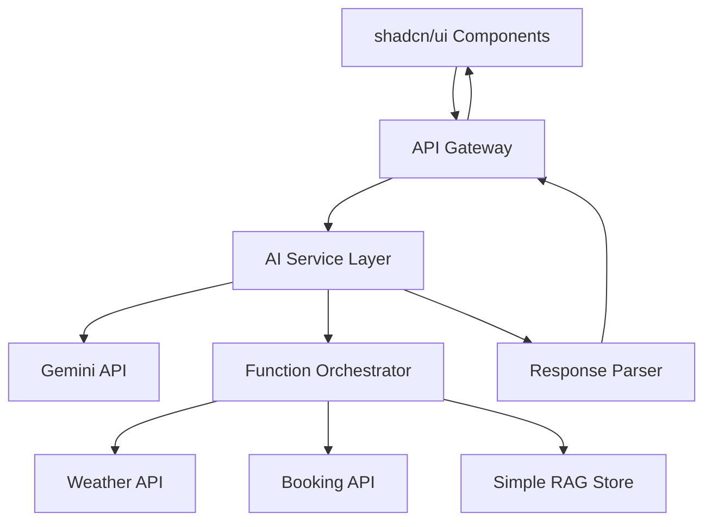
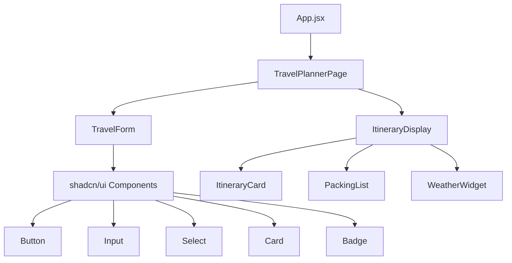
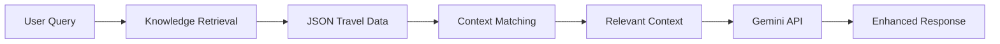
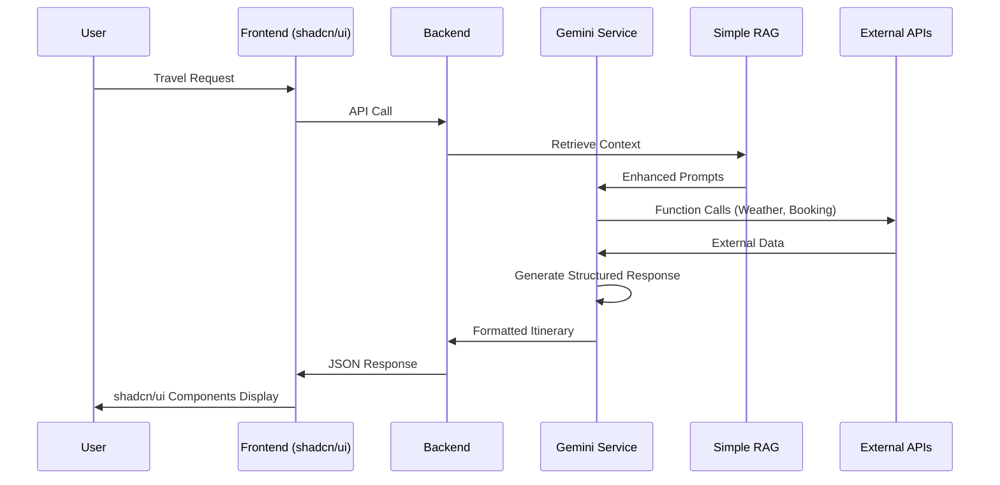

# Gen AI Project Setup Design - Smart Travel Assistant

## Overview

This design document outlines the implementation of 7 core Gen AI concepts in the Smart Travel Assistant project. Each concept will be implemented in separate Git branches with focused pull requests, demonstrating advanced AI integration techniques including prompting, function calling, structured output, and model parameter optimization.

## Repository Type Analysis

**Project Type**: Full-Stack AI Application
- **Frontend**: React with Tailwind CSS + shadcn/ui components
- **Backend**: Node.js/Express API server
- **AI Integration**: Google Gemini API with advanced features
- **Data Layer**: Simple JSON-based RAG for travel knowledge

## Architecture Overview



## Implementation Roadmap

### Branch 1: System and User Prompts (RTFC Framework)

**Branch Name**: `feature/system-user-prompts`

**Implementation Details**:
- Create `backend/services/promptService.js`
- Implement RTFC (Role, Task, Format, Context) framework
- System prompt defines AI assistant role and capabilities
- User prompt templates for different travel planning scenarios
- Set up simple RAG knowledge retrieval
- Initialize shadcn/ui components

**Core Components**:
```javascript
// System Prompt Structure with RAG
const systemPrompt = {
  role: "Expert travel planning assistant with access to travel knowledge base",
  task: "Generate personalized travel itineraries using provided context",
  format: "Structured JSON responses with clear categorization",
  context: "User preferences, travel constraints, and retrieved knowledge"
}

// RAG-Enhanced Prompt
const createEnhancedPrompt = (userQuery, ragContext) => {
  return `
    Based on the following travel knowledge:
    ${JSON.stringify(ragContext, null, 2)}
    
    User Request: ${userQuery}
    
    Generate a comprehensive travel plan...
  `
}
```

**Files to Create/Modify**:
- `backend/services/promptService.js`
- `backend/config/prompts.js`
- `backend/services/simpleRAG.js`
- `backend/data/travelKnowledge.json`
- `frontend/components/ui/` (shadcn/ui setup)
- `frontend/components/TravelForm.jsx`
- Update `backend/services/geminiService.js`

### Branch 2: Function Calling Implementation

**Branch Name**: `feature/function-calling`

**Implementation Details**:
- Define function schemas for external API calls
- Implement weather data fetching function
- Implement booking availability function
- Create function execution handler

**Function Definitions**:
```javascript
const functions = [
  {
    name: "getWeatherData",
    description: "Fetch weather forecast for destination",
    parameters: {
      type: "object",
      properties: {
        location: { type: "string" },
        dates: { type: "array" }
      }
    }
  },
  {
    name: "getBookingOptions",
    description: "Fetch flight/hotel availability",
    parameters: {
      type: "object",
      properties: {
        from: { type: "string" },
        to: { type: "string" },
        dates: { type: "array" }
      }
    }
  }
]
```

**Files to Create/Modify**:
- `backend/services/functionService.js`
- `backend/functions/weatherFunction.js`
- `backend/functions/bookingFunction.js`
- Update `backend/services/geminiService.js`

### Branch 3: Structured Output Implementation

**Branch Name**: `feature/structured-output`

**Implementation Details**:
- Define JSON schema for travel itinerary response
- Implement response validation
- Create type-safe output parsing

**Output Schema**:
```javascript
const itinerarySchema = {
  type: "object",
  properties: {
    itinerary: {
      type: "array",
      items: {
        type: "object",
        properties: {
          day: { type: "number" },
          activities: { type: "array", items: { type: "string" } },
          meals: { type: "array" },
          transportation: { type: "string" }
        }
      }
    },
    packing_list: { type: "array", items: { type: "string" } },
    estimated_budget: { type: "object" },
    booking_recommendations: { type: "object" }
  }
}
```

**Files to Create/Modify**:
- `backend/schemas/travelSchema.js`
- `backend/validators/responseValidator.js`
- Update `backend/services/geminiService.js`

### Branch 4: Temperature Configuration

**Branch Name**: `feature/temperature-config`

**Implementation Details**:
- Implement dynamic temperature settings
- Create temperature optimization for different request types
- Add temperature logging and monitoring

**Temperature Strategy**:
- **Creative tasks** (itinerary generation): 0.7-0.9
- **Factual queries** (weather, bookings): 0.1-0.3
- **Structured responses**: 0.2-0.4

**Files to Create/Modify**:
- `backend/config/geminiConfig.js`
- `backend/services/temperatureService.js`
- Update `backend/services/geminiService.js`

### Branch 5: Token Tracking and Logging

**Branch Name**: `feature/token-tracking`

**Implementation Details**:
- Implement comprehensive token usage logging
- Create token consumption analytics
- Add cost estimation based on token usage
- Real-time token monitoring in console

**Token Logging Structure**:
```javascript
const tokenLog = {
  timestamp: Date.now(),
  requestType: "itinerary_generation",
  promptTokens: 150,
  completionTokens: 800,
  totalTokens: 950,
  estimatedCost: 0.0015,
  model: "gemini-2.0-flash"
}
```

**Files to Create/Modify**:
- `backend/services/tokenService.js`
- `backend/utils/logger.js`
- `backend/middleware/tokenMiddleware.js`
- Update `backend/services/geminiService.js`

### Branch 6: Top-K Implementation

**Branch Name**: `feature/top-k-sampling`

**Implementation Details**:
- Implement Top-K parameter configuration
- Create adaptive Top-K based on request complexity
- Add Top-K performance monitoring

**Top-K Strategy**:
- **Diverse creative output**: K = 40-50
- **Focused responses**: K = 10-20
- **Highly specific queries**: K = 5-10

**Files to Create/Modify**:
- `backend/config/samplingConfig.js`
- `backend/services/topKService.js`
- Update `backend/services/geminiService.js`

### Branch 7: Top-P Implementation

**Branch Name**: `feature/top-p-nucleus`

**Implementation Details**:
- Implement nucleus sampling with Top-P
- Create dynamic Top-P adjustment
- Balance creativity and coherence

**Top-P Strategy**:
- **Creative content**: P = 0.8-0.95
- **Factual content**: P = 0.1-0.5
- **Mixed content**: P = 0.6-0.8

**Files to Create/Modify**:
- `backend/config/nucleusSampling.js`
- `backend/services/topPService.js`
- Update `backend/services/geminiService.js`

## Frontend Architecture with shadcn/ui

### Component Structure


### shadcn/ui Integration

**Installation Commands**:
```bash
npx shadcn-ui@latest init
npx shadcn-ui@latest add button
npx shadcn-ui@latest add input
npx shadcn-ui@latest add select
npx shadcn-ui@latest add card
npx shadcn-ui@latest add badge
npx shadcn-ui@latest add calendar
npx shadcn-ui@latest add form
```

**Component Examples**:
```javascript
// TravelForm Component
import { Button } from "@/components/ui/button"
import { Input } from "@/components/ui/input"
import { Select } from "@/components/ui/select"
import { Card } from "@/components/ui/card"

export function TravelForm() {
  return (
    <Card className="p-6">
      <form className="space-y-4">
        <Input placeholder="Destination" />
        <Select>
          <SelectTrigger>
            <SelectValue placeholder="Number of travelers" />
          </SelectTrigger>
        </Select>
        <Button type="submit">Plan My Trip</Button>
      </form>
    </Card>
  )
}
```

## Core Gemini AI Service Architecture

```mermaid
graph LR
    A[AI Request] --> B[Prompt Service]
    B --> C[Simple RAG]
    C --> D[Function Calling]
    D --> E[Structured Output]
    E --> F[Parameter Optimization]
    F --> G[Token Tracking]
    G --> H[Gemini API]
    H --> I[Response Processing]
    I --> J[Validation]
    J --> K[shadcn/ui Display]
```



## Implementation Workflow

### Phase 1: Environment Setup
1. Create branch structure
2. Set up Gemini API configuration
3. Initialize shadcn/ui components
4. Create simple RAG knowledge store

### Phase 2: Core Features Implementation
1. **Week 1**: System/User prompts + Function calling
2. **Week 2**: Structured output + Temperature config
3. **Week 3**: Token tracking + Top-K implementation
4. **Week 4**: Top-P implementation + Integration testing

### Phase 3: Integration and Testing
1. End-to-end testing across all branches
2. Performance optimization
3. Documentation and video creation

## Git Workflow Strategy

### Branch Management
```bash
# Feature branch creation pattern
git checkout -b feature/[concept-name]
git add .
git commit -m "Implement [concept]: [description]"
git push origin feature/[concept-name]
# Create PR for each branch
```

### PR Requirements
- Each PR focuses on single Gen AI concept
- Include implementation details in PR description
- Add code comments explaining Gen AI concepts
- Include test cases for implemented features

## API Integration Points

### Gemini API Configuration
```javascript
const geminiConfig = {
  model: "gemini-2.0-flash",
  temperature: 0.7, // Dynamic based on request type
  maxOutputTokens: 2000,
  topP: 0.9,       // Nucleus sampling
  topK: 40,        // Top-K sampling
  safetySettings: [
    {
      category: "HARM_CATEGORY_HARASSMENT",
      threshold: "BLOCK_MEDIUM_AND_ABOVE"
    }
  ],
  tools: [],       // Dynamic function definitions
  generationConfig: {
    responseMimeType: "application/json",
    responseSchema: {} // Dynamic schema
  }
}
```

### External API Integrations
- **Weather API**: Real-time weather data for destinations
- **Booking APIs**: Flight and hotel availability
- **Simple RAG**: JSON-based travel knowledge store

## Simple RAG Implementation

### RAG Architecture


### Knowledge Store Structure
```javascript
const travelKnowledge = {
  destinations: {
    "goa": {
      bestTime: "November to February",
      activities: ["beach", "water sports", "nightlife"],
      cuisine: ["seafood", "konkani", "portuguese"],
      tips: ["Carry sunscreen", "Book early in peak season"]
    },
    "delhi": {
      bestTime: "October to March",
      activities: ["historical sites", "shopping", "food tours"],
      cuisine: ["street food", "north indian", "mughlai"],
      tips: ["Use metro for transportation", "Avoid summer months"]
    }
  },
  general: {
    packing: {
      "beach": ["swimwear", "sunscreen", "sandals"],
      "mountain": ["warm clothes", "trekking shoes", "jacket"],
      "city": ["comfortable shoes", "light clothes", "umbrella"]
    }
  }
}
```

### RAG Service Implementation
```javascript
class SimpleRAGService {
  static retrieveContext(query, destination) {
    const relevantInfo = [];
    
    // Destination-specific knowledge
    if (travelKnowledge.destinations[destination.toLowerCase()]) {
      relevantInfo.push(travelKnowledge.destinations[destination.toLowerCase()]);
    }
    
    // Activity-based knowledge
    const activities = this.extractActivities(query);
    activities.forEach(activity => {
      if (travelKnowledge.general.packing[activity]) {
        relevantInfo.push(travelKnowledge.general.packing[activity]);
      }
    });
    
    return relevantInfo;
  }
}
```

## Data Flow Architecture



## Testing Strategy

### Unit Testing
- Individual Gen AI concept testing
- Function calling validation
- Structured output schema testing
- Token calculation accuracy

### Integration Testing
- End-to-end AI pipeline testing
- External API integration testing
- Response validation testing
- Performance benchmarking

### AI Model Testing
- Temperature variation testing
- Top-K/Top-P parameter optimization
- Prompt effectiveness validation
- Function calling accuracy testing

## Monitoring and Analytics

### Gemini Token Usage Monitoring
```javascript
const geminiTokenAnalytics = {
  dailyUsage: 0,
  monthlyLimit: 1000000, // Gemini free tier
  costPerToken: 0.000002, // Gemini pricing
  requestTypes: {
    itinerary: { avgTokens: 1200 },
    weather: { avgTokens: 180 },
    booking: { avgTokens: 250 }
  }
}
```

### Performance Metrics
- Response time per AI call
- Function calling success rate
- Structured output validation rate
- User satisfaction scores

## Security Considerations

### API Key Management
- Environment variable storage for Gemini API key
- Rate limiting implementation
- Request validation and sanitization
- Error handling for Gemini API failures
- shadcn/ui error boundaries

### Data Privacy
- User input sanitization
- No sensitive data in logs
- Secure external API communications
- GDPR compliance for travel data